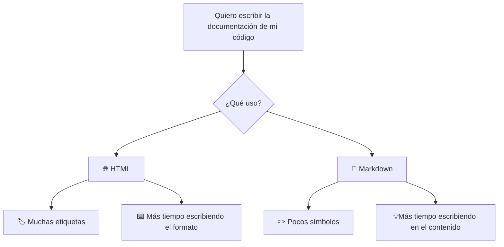

# Capítulo 00: ¿Qué es Markdown?

😊 Muy bien querido lector, siéntate cómodo. ☕ 
Esta historia se remonta a 2004, aunque en realidad se puede decir que comenzó con la invención de la World Wide Web, pero ¿para qué ir tan atrás en el tiempo?  

Te introduzco a nuestro creador estrella. John Gruber, aunque Aaron Swartz colaboró en el desarrollo de la sintaxis, pero él no es el importante (Lo siento Aaron 🤣). Gruber sí lo es y en 2004, inventó Markdown con el objetivo de “Disfrutar escribir” sin preocuparse de etiquetas o instrucciones de formato. 😁

Imagínate esta lógica: Tienes un informe importantísimo y te olvidaste. Te sientas frente a la computadora (Después de llorar 😭) y tomas la valiosa decisión de utilizar sabiamente tu tiempo: 

- Opción a) Gastar media hora en una portada bonita. 
- Opción b) Terminar el informe con letra estándar.

💁🏻‍♀️ Supongo que la respuesta es bastante obvia o no?

Y así nació Markdown.

---
**Nota curiosa:** “Markdown” viene de la expresión inglesa “To mark up” que significa, “Marcar un texto”. Tiene sentido si lo piensas, antes de las computadoras los correctores hacían marcas sobre los manuscritos. En vez de decirte “haz esto más bonito”, Markdown lo señala con el dedo y dice “esto es un título”. 

---

## Pregunta: ¿Por qué se le llama **ligero**?

Tómate un tiempo para pensar...  🤔

Respuesta
Markdown es un lenguaje de marcado ligero (lightweight markup language) que permite estructurar documentos utilizando únicamente texto plano.

## Entonces, en ¿Qué se enfoca Markdown?

| OPCIONES | SI o NO |
| :--- | ---: | 
| Fuentes | ✖️ | 
| Tamaños | ✖️ | 
| Colores | ✖️ | 
| Contenido |✅ | 

Los que escriben en Markdown no esperan que la primera letra al iniciar un capítulo cubra un cuarto de página como los libros antiguos, sino que al leerlo, se entienda. Fácil y bonito. 

Además, que sea **ligero** tampoco hace referencia a que el archivo pese poco. Sino que la sintaxis -orden, reglas- sea mínima. Mientras que HTML necesita de etiquetas, elementos, atributos. La sintaxis de Markdown se compone enteramente de signos de puntuación. Veámoslo en un ejemplo: 

| HTML: | Markdown: |
| :--- | :--- |
| `<h2>Capítulo 00</h2>` | `## Capítulo 00` |
| `
Este es un párrafo.
` | `Este es un párrafo.` |

Ojo, HTML es un formato de publicación y Markdown de escritura. No lo va a sustituir, simplemente busca facilitar la lectura, escritura y edición de texto. 

## Y finalmente, ¿qué significa que sea plano? 🗺️

Es como un cambiaformas que puede abrirse en cualquier parte. Un archivo Word (.docx), aunque se vea sencillo, está lleno de: Formatos, imágenes, fuentes, colores, estilos, tablas, metadatos.. etc. 

Por otro lado, nuestra bestia cambiaformas (.md) es texto. Se puede abrir en bloc de notas, VS Code, Vim, Nano, etc. Es multifacetico! 💥

## Figura 1: Resumen del capítulo 00

---

🏠 [Volver a la portada](../README.md)

➡️ [Capítulo 01: ¿Por qué GitHub usa Markdown?](../GitHub/01-Por-qué-GitHub-usa-Markdown.md)